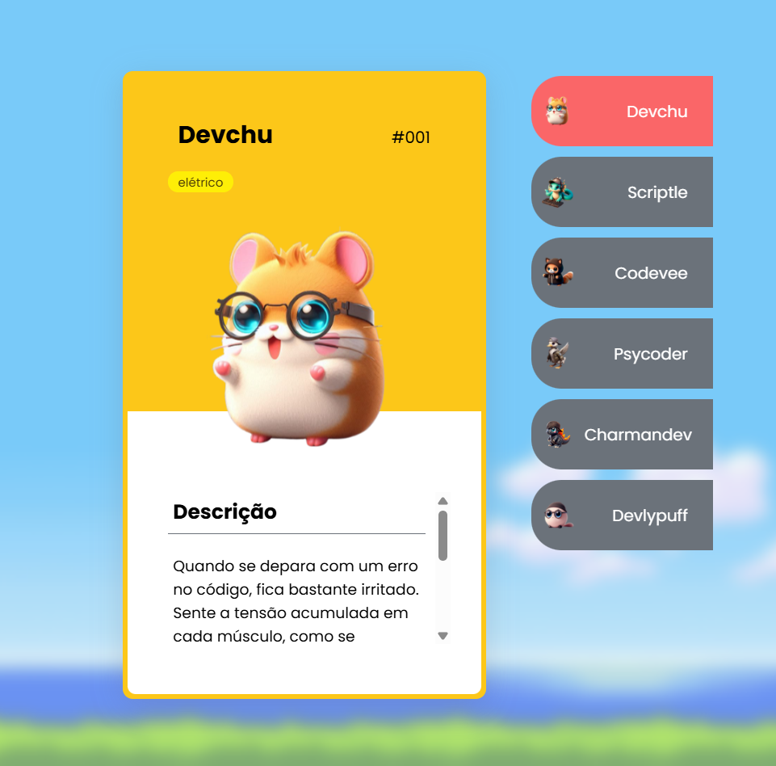

# PokeDev

Uma Pokédex diferente — feita para desenvolvedores!  
Esse projeto é uma aplicação interativa desenvolvida com **HTML**, **CSS** e **JavaScript**, onde você pode visualizar um "card" com informações sobre cada PokéDev (desenvolvedor com estilo de Pokémon).

## Visão Geral

O objetivo do projeto é aplicar conceitos de manipulação de DOM, responsividade e estilização moderna usando apenas tecnologias do front-end.  
Ao clicar em um item da lista, o cartão com as informações do desenvolvedor é exibido ao lado.

## Tecnologias Utilizadas

- **HTML5** – Estruturação da página.
- **CSS3** – Estilização dos componentes e efeitos visuais.
- **JavaScript** – Interatividade e manipulação do DOM.
- **Responsividade** – Adaptação para telas menores usando `media queries`.

## Funcionalidades

- Listagem dos PokéDevs com seus respectivos ícones e nomes.
- Ao clicar em um PokéDev, seu card com descrição e tipo é exibido.
- Destaque visual do item ativo.
- Layout responsivo para celulares e tablets.

## Ilustração
